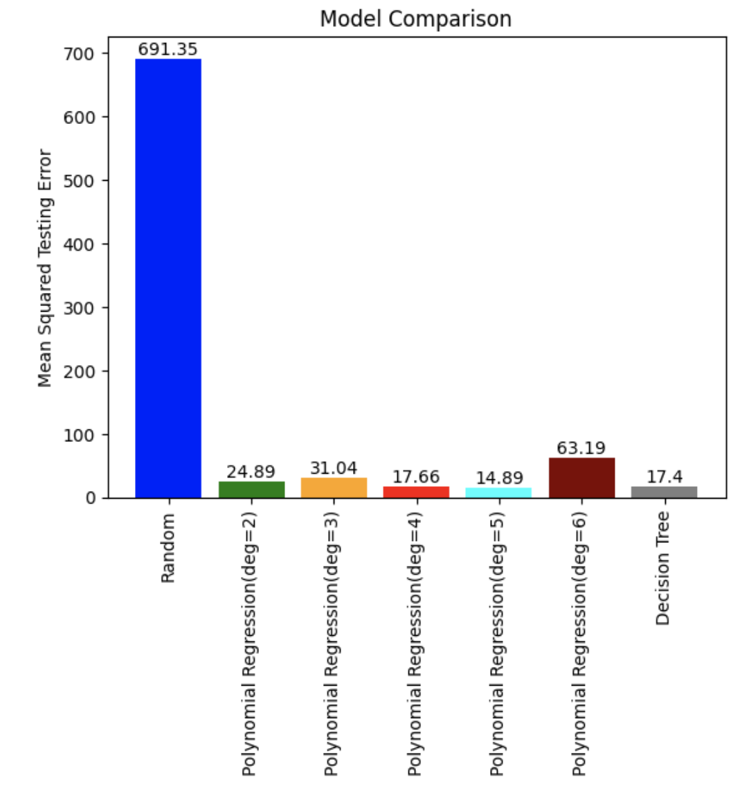

# Work Showcase: Machine Learning Demonstration
In this demonstration I'll conduct machine learning to make determinations on climates utilizing different methods and Python packages. Additionally, I will conduct machine learning using two different primary modes: vectorizing location names and analyzing latitudes and longitudes. For both of these means I will utilize the same methods to demonstrate their effectivity in this context. The area of interest for this program is using neural networks as a predictor on a given location for what the climate in the region may look like. As climate change becomes an increasingly important issue, having accurate, unbiased assessors like this model will become more and more useful.

## Data Clean-Up / Organization
Cleaning the data in this instance was a multi-step process. Firstly, I had to find an accurate source of information. NOAA has documents going back decades, so in this case, they had a useful normalized average for the last 30 years. Next, I had to break the data into relevant subgroups that could be judged together or separately, as needed. After this, I was most interested in 2 things: what the region actually was and the annual temperatures. Using a package called geopy.geocoders, I was also able to automate the process of determining the coordinates for a named location.

## Supervised Machine Learning
Machine learning can be broadly categorized into three main types: supervised learning, unsupervised learning, and reinforcement learning. Supervised learning is a type of machine learning where the algorithm is trained on a labeled dataset, meaning that the input data is paired with corresponding output labels. The goal is for the algorithm to learn the mapping function from the input to the output, enabling it to make predictions or classifications on new, unseen data. This learning process involves providing the model with examples of input-output pairs, allowing it to generalize patterns and relationships within the data.

In this model, the metric for success is the MSE, or the Mean Squared Error. The higher the MSE for a given method, the worse that method is. Having an MSE of 0 would theoretically mean a perfect method, but realistically means a cheating one (one that knows the end result), and is therefore a poor result, too.

## Results
Below are screenshots of the bar graphs comparing the results for testing and training MSEs for the vectorized and numeric data, respectively. The comparison between the testing and training results is to demonstrate that our models are not cheating. If there was no appreciable difference between their results, this would be a red flag. The fact that training errors are lower across the bar is an indication of a real, properly-fitted model.

### Vectorized

### Numeric

